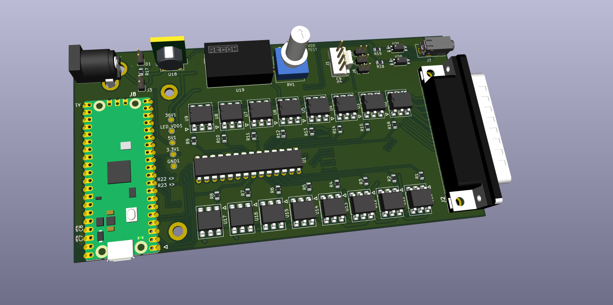
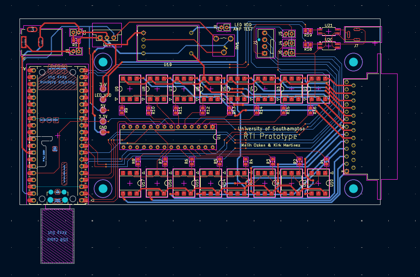
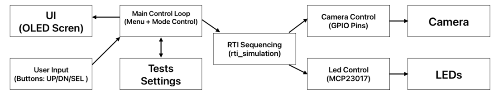
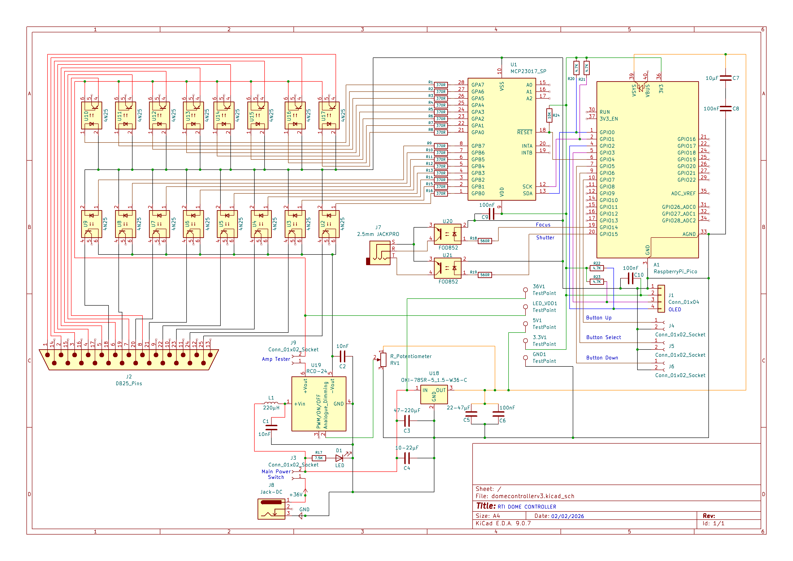
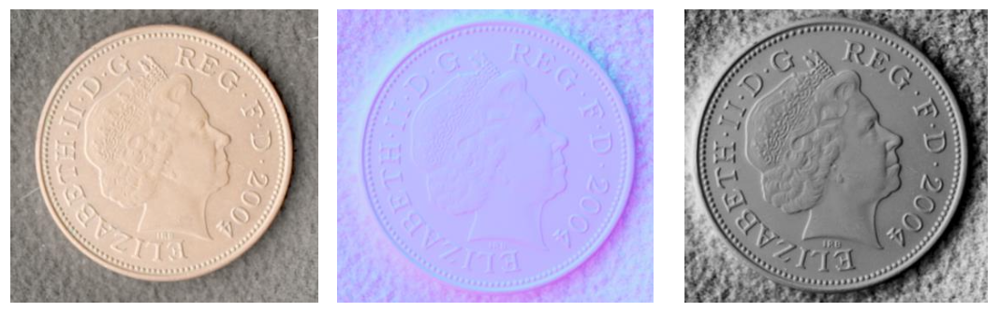

# RTI Dome Controller Firmware

> Firmware for a custom Reflectance Transformation Imaging (RTI) dome designed for automated image acquisition using a Raspberry Pi Pico, custom PCB, and 64-LED illumination system.


---

## Overview

This repository contains the firmware developed for a custom Reflectance Transformation Imaging (RTI) capture system.

The project was designed to automate the acquisition of RTI datasets by controlling a 64-LED illumination array and synchronising image capture with a DSLR camera. The firmware communicates with external hardware via I²C, controls a custom LED switching network, and provides reliable and repeatable timing for image acquisition.

The firmware is implemented in **MicroPython** running on a Raspberry Pi Pico. MicroPython was selected to enable rapid development, hardware iteration, and easier debugging during the prototyping phase while providing reliable and repeatable control of the LED sequencing and camera triggering required for RTI image acquisition.

This project was completed as part of my final-year Computer Science project at the University of Southampton.

The system was developed from the ground up, including firmware, custom PCB design, mechanical design, and hardware integration.

---

### LED Sequencing

The firmware sequentially activates each LED in the 8×8 switching matrix while synchronising image capture with the DSLR camera.


---

## What is Reflectance Transformation Imaging (RTI)?

Reflectance Transformation Imaging (RTI) is a computational photography technique used to reveal fine surface details by capturing multiple images of an object under different lighting directions.

Instead of moving the camera, the object remains stationary while individual LEDs illuminate it from known positions. Each image is captured under a different lighting angle, and the resulting image set is processed using RTI software to generate an interactive model where the virtual light source can be moved dynamically.

RTI is widely used in:

- Archaeology
- Cultural heritage preservation
- Museum documentation
- Forensic analysis
- Surface inspection

This project automates the image acquisition process by precisely controlling the lighting sequence and synchronising image capture with a DSLR camera.

---
## Project Objectives

The firmware was designed and implemented to:

- Independently control 64 LEDs through an 8×8 switching matrix
- Synchronise LED illumination with DSLR image capture
- Provide configurable timing between lighting and shutter activation
- Reduce GPIO usage through an I²C GPIO expander
- Produce repeatable RTI image datasets
- Interface with custom PCB hardware

---

## Hardware Overview

The complete system consists of:

- Raspberry Pi Pico
- MCP23017 I²C GPIO Expander
- 16 PhotoMOS Switches
- 64 High-Power LEDs
- Constant Current LED Driver
- SSD1306 OLED Display
- Nikon Z6 Camera
- Custom PCB
- 3D Printed RTI Dome

---

## System Architecture

```text
                         Raspberry Pi Pico
                                │
                 ┌──────────────┴──────────────┐
                 │                             │
               GPIO                           I²C
                 │                             │
        Camera Trigger Output             MCP23017
                 │                             │
            Nikon Z6                   PhotoMOS Switches
                                               │
                                      8×8 LED Switching Matrix
                                               │
                                           64 LEDs
```

---

## Firmware Features

### Hardware Initialisation

- GPIO configuration
- Peripheral initialisation
- I²C setup
- Device startup checks

### User Interface

- SSD1306 OLED display
- System status information
- Capture progress display
- User-configurable capture settings

### LED Control

- Individual LED selection
- Matrix-based LED addressing
- Deterministic illumination sequence
- Configurable LED timing

### Camera Control

- DSLR trigger output
- Synchronised capture timing
- Adjustable shutter delay

### I²C Communication

- MCP23017 control
- Efficient GPIO expansion
- Reliable communication with external hardware

### Capture Sequencing

The firmware automatically performs:

1. Select LED
2. Enable LED
3. Wait for stabilisation
4. Trigger camera
5. Wait for exposure
6. Disable LED
7. Advance to next LED

This process repeats until every LED has been activated exactly once.

---

## Engineering Challenges

Several hardware and firmware challenges were addressed during development:

- Designed an 8×8 LED switching matrix to independently control 64 LEDs while minimising the number of required control signals.
- Implemented I²C communication between the Raspberry Pi Pico and MCP23017 GPIO expander.
- Developed deterministic sequencing between LED activation and DSLR shutter triggering.
- Implemented configurable timing parameters to support different camera exposure requirements.
- Debugged and corrected hardware issues discovered during PCB assembly and system integration.
- Integrated firmware, custom electronics, PCB hardware, camera control, and the 3D-printed dome into a complete working system.

---

## Technologies Used

### Programming

- MicroPython

### Embedded Systems

- GPIO
- I²C
- Embedded timing
- Hardware abstraction
- State-machine style sequencing

### Electronics

- Custom PCB Design
- MCP23017 GPIO Expander
- PhotoMOS Switching
- LED Driver Design
- Hardware Debugging

### Mechanical

- 3D Printed Dome
- Modular Assembly
- Hardware Integration

---

## Project Structure

```text
.
├── src/
│   ├── main.py
│   ├── mcp23017.py
│   ├── settings.txt
│   └── ssd1306.py
├── images/
└── README.md

```

*(Repository structure may change as development continues.)*

---

## Running the Firmware

1. Flash the latest MicroPython firmware onto the Raspberry Pi Pico.
2. Copy the project files to the Pico using Thonny or another MicroPython IDE.
3. Ensure the required hardware is connected.
4. Run `src/main.py` to start the RTI controller.

---

## Future Improvements

Potential future enhancements include:

- Configurable capture profiles for different camera and exposure settings.
- Audible status notifications using a piezo buzzer for errors and capture completion.
- Refactoring the firmware into a more object-oriented architecture to improve modularity, maintainability, and code reuse.

---

## Gallery

### RTI Dome


---

### Controller PCB





---

### Finished Controller


---


### System Architecture Diagram



---

### PCB Schematic



---

### RTI Images Generated from this project



---

### Skills Demonstrated

This project demonstrates experience in:

- Embedded Firmware Development
- MicroPython Development
- Raspberry Pi Pico
- Embedded Python
- GPIO Programming
- I²C Communication
- Hardware/Software Integration
- PCB Design
- LED Driver Control
- Embedded Debugging
- System Integration
- Engineering Design Iteration

---

## Lessons Learned

This project involved significantly more than firmware development. It required close integration between software, electronics, PCB design, mechanical design, and manufacturing.

Through multiple hardware revisions and iterative testing, I gained practical experience in designing reliable embedded systems and solving real-world engineering problems where firmware and hardware must work together.

---

## License

This project is released under the MIT License.
